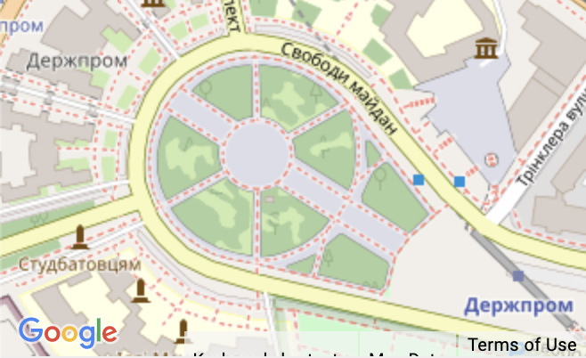
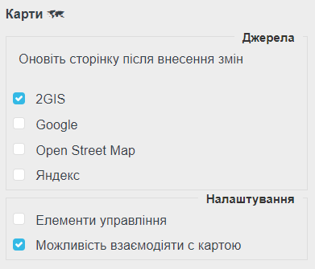

# WME 🇺🇦 E58

Create map preview from external sources



## Settings



## Shortcuts

<table style="width:100%">
<tr>
  <th>Shortcut</th>
  <th>Description</th>
</tr>
<tr>
<td align='center'><code>Alt</code>+<code>N</code></td>
<td>Show/hide a small modal window with a map</td>
</tr>
</table>

## Development

```bash
npm install     # install dependencies
npm run build   # build dist/WME-E58.user.js
npm run watch   # rebuild on changes
```

### Project Structure

```
src/
├── meta.ts              # userscript header
├── style.css            # plain CSS
├── globals.d.ts         # WME runtime type declarations
├── translations.ts      # NAME, TRANSLATION (en, uk, ru)
├── settings.ts          # default settings
├── map-preview.ts       # MapPreview, GooglePreview, OSMPreview
├── e58.ts               # E58 class (extends WMEBase)
└── index.ts             # bootstrap entry point
```

## Links

Author homepage: https://anton.shevchuk.name/    
Author pet projects: https://hohli.com/  
Support author: https://donate.hohli.com/  

Script homepage: https://github.com/AntonShevchuk/wme-e58/    
GreasyFork: https://greasyfork.org/uk/scripts/390207-wme-e58-map-s-previews  
