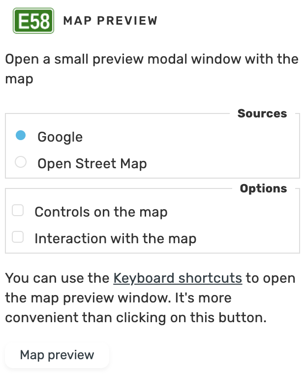

# WME E58
Create map preview from external sources

## Settings

## Shortcuts
<table style="width:100%">
<tr>
  <th>Shortcut</th>
  <th>Description</th>
</tr>
<tr>
<td align='center'><code>Z</code></td>
<td>Show/hide small modal window with a map</td>
</tr>
</table>

## Links
Author homepage: http://anton.shevchuk.name/  
Script homepage: https://github.com/AntonShevchuk/wme-e58/  
GreasyFork: https://greasyfork.org/uk/scripts/390207-wme-e58-map-s-previews  
